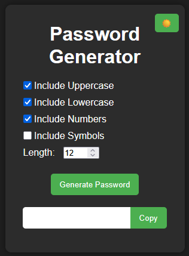

# Password Generator

A polished, customizable password generator built with vanilla HTML, CSS, and JavaScript.

This project features:
- Light/Dark mode toggle 🌙☀️
- Randomized “thinking” animation before generating password 🎰
- Customizable options: uppercase, lowercase, numbers, symbols, length 🔧
- Subtle shake animation when password is ready 💥
- Copy-to-clipboard button for convenience 📋
- Clean, modern responsive design

You can try the live demo here:  
👉 [https://tanshindnmt.github.io/password-generator/](https://tanshindnmt.github.io/password-generator/)

---

## Screenshots

---

## Tech Stack
- HTML5
- CSS3
- Vanilla JavaScript (ES6)

---

## Why I built this
As part of my learning journey as a self-taught developer, I wanted to go beyond a basic password generator by adding real-world UI/UX touches and making it portfolio-ready. This project was also part of my preparation for entering the software engineering industry.

---

## License
MIT
